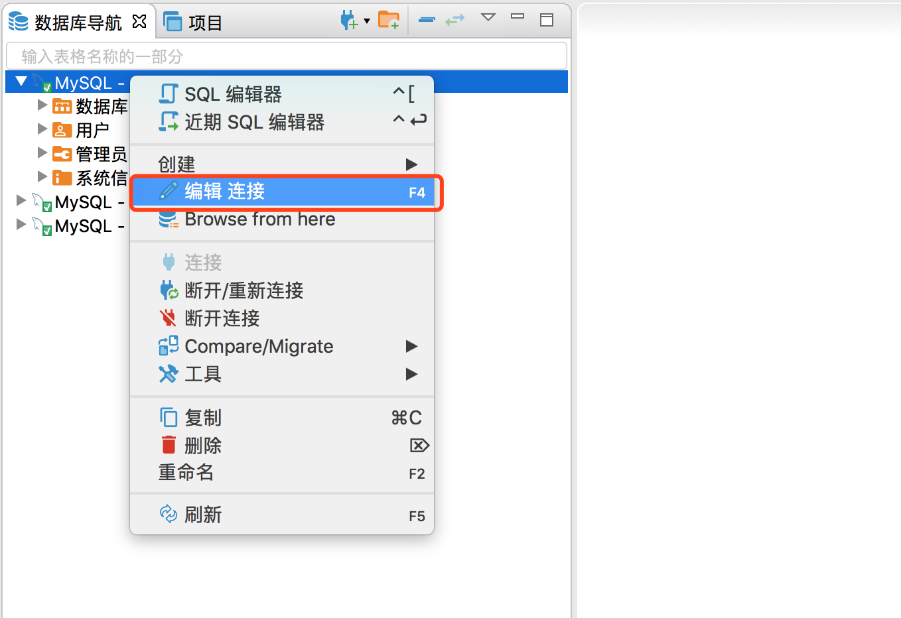
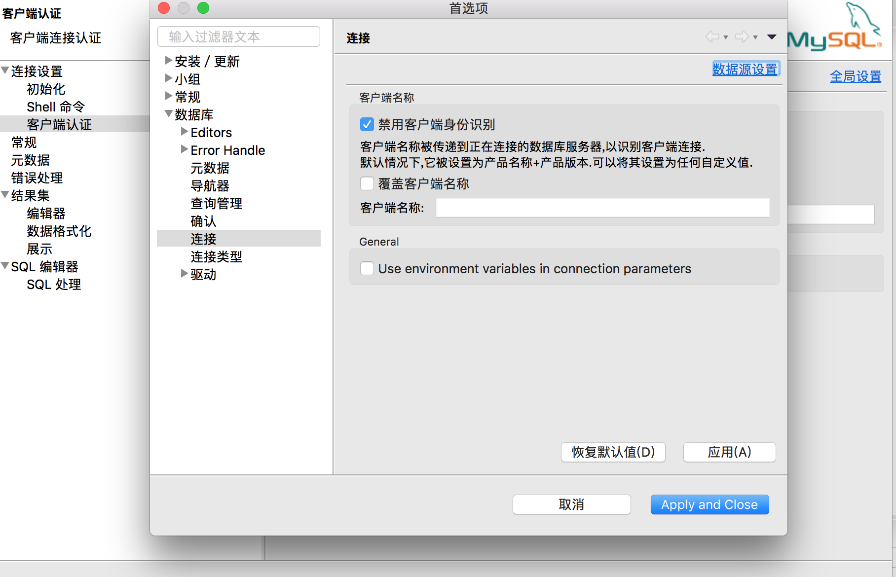
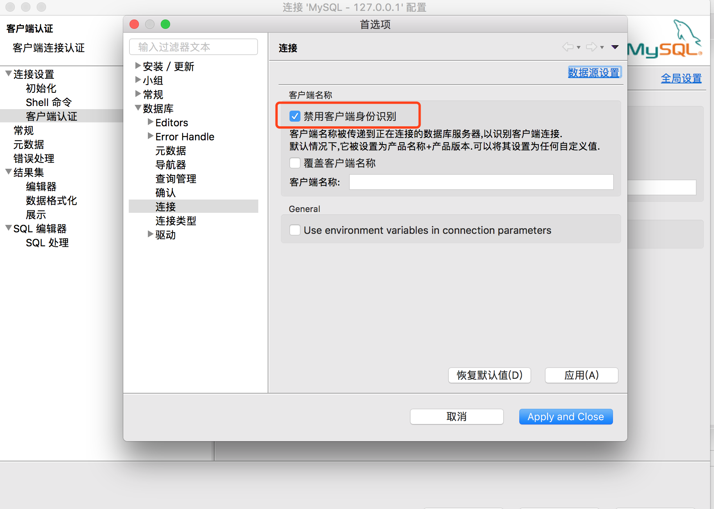
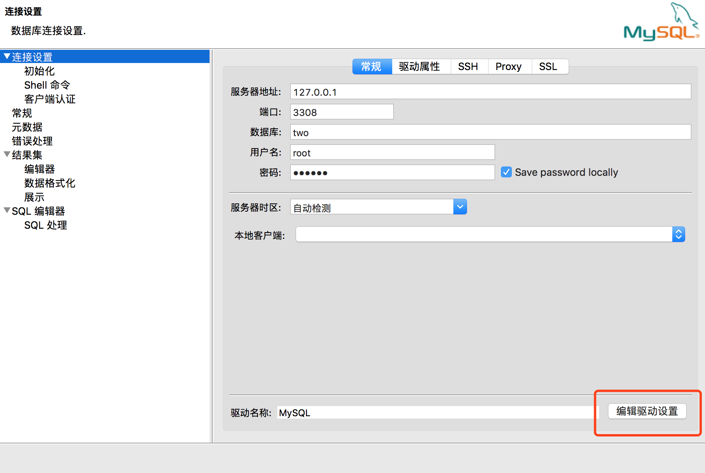
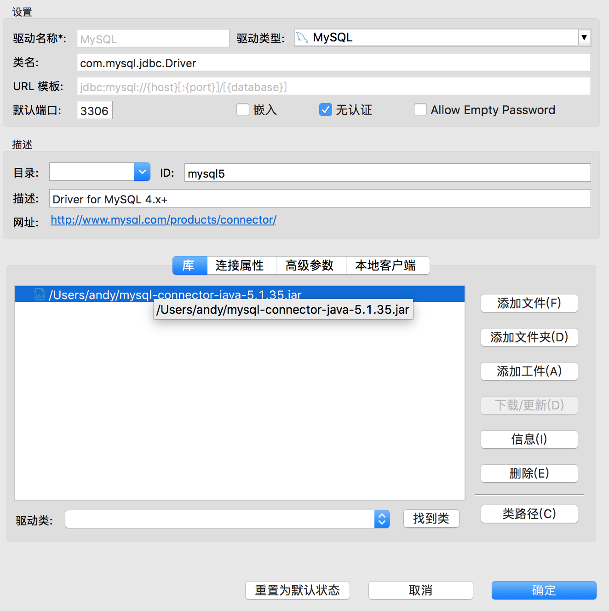

## Version
As far as I know, already supported DBeaver 6.1.5/7.1.5, but need set some options.

## options
Set some options
1. right click , and left click , and choose Disable 

2. On the interface about , choose the suitable  about mysql-connector-java-5.1.35.jar
